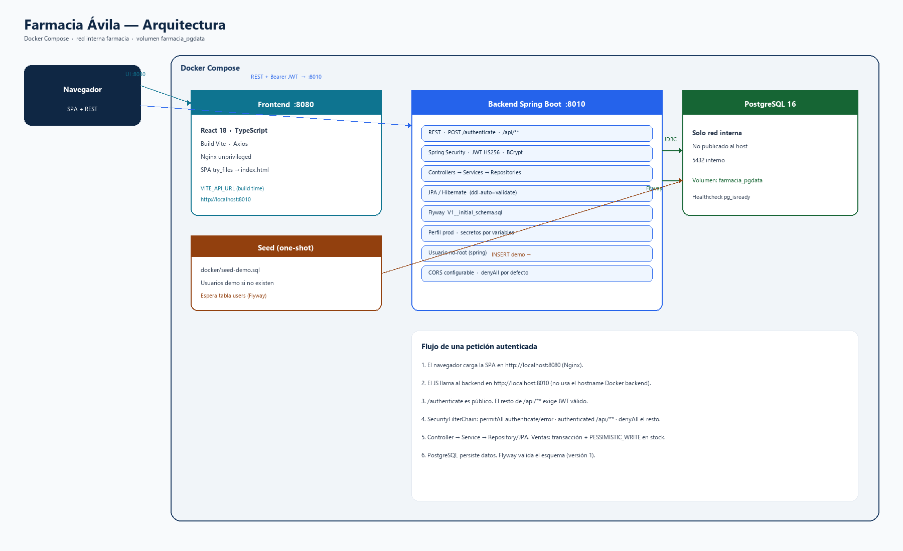
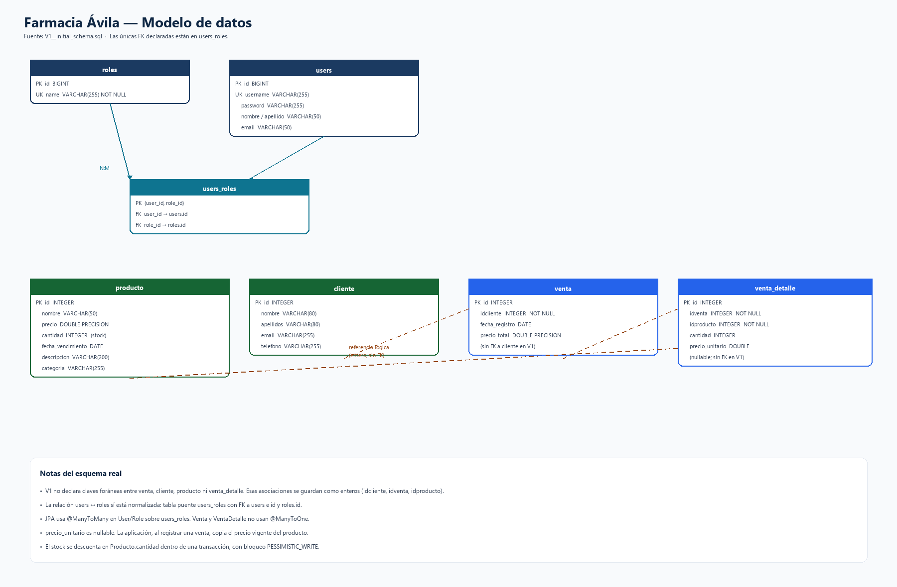

# Farmacia Ávila

Sistema web full stack para el mostrador de una farmacia: catálogo, clientes, ventas e inventario, con dos roles (**ADMIN** y **Vendedor**).

React + TypeScript · Spring Boot 3.3.4 (Java 21) · PostgreSQL · JWT · Docker Compose

---

## ⭐ Características destacadas

- Autenticación JWT (HS256) y contraseñas con BCrypt
- Autorización por roles en el backend (`@PreAuthorize`)
- Ventas transaccionales: total en servidor, descuento de stock y **409** si no alcanza
- Bloqueo `PESSIMISTIC_WRITE` al actualizar stock
- Esquema con Flyway; Hibernate `ddl-auto=validate` en local y prod
- Entorno reproducible con Docker Compose
- 57 pruebas automatizadas de backend (JUnit 5)

---

## ✨ Funcionalidades

### Autenticación y usuarios

Inicio de sesión en `POST /authenticate`. El backend responde con un JWT y datos de usuario **sin** contraseña.

Las contraseñas se almacenan con BCrypt. Los roles viven en base de datos: `ADMIN` y `Vendedor`. El CRUD de `/api/users` es exclusivo de ADMIN.

En el cliente, la sesión se guarda en `localStorage` y se ocultan las pantallas de productos y usuarios si el rol no es ADMIN. **Eso es solo UI:** las reglas que importan están en la API.

### Productos

Listado, detalle y búsqueda por nombre o categoría. Crear, editar y borrar productos: solo ADMIN. El stock es el campo `cantidad` (lo cambia un ADMIN al editar, o una venta al descontar).

### Clientes

Consulta, alta y edición: cualquier usuario autenticado. Eliminar: solo ADMIN. En la interfaz, el botón Eliminar no se muestra al Vendedor.

### Ventas

Listado y detalle. El alta (`POST /api/venta`) la pueden hacer ADMIN y Vendedor: cliente, líneas (producto y cantidad) y total calculado en el servidor con el precio vigente del producto. Si el stock no alcanza, la API responde **409**. No hay PUT ni DELETE de ventas.

### Interfaz

Login, dashboard (conteos y stock bajo con umbral **10** en el frontend), clientes, ventas, inventario (consulta de stock y vencimientos), productos (ADMIN) y usuarios (ADMIN). Un **401** de la API cierra la sesión.

### Infraestructura

Docker Compose levanta PostgreSQL 16 (solo red interna), backend en `:8010`, frontend con Nginx en `:8080` y un seed one-shot. Flyway usa `V1__initial_schema.sql` en perfiles `local` y `prod`. Los tests usan H2 y no ejecutan Flyway.

---

## 🔄 Flujo principal

1. El usuario inicia sesión en la SPA.
2. El backend valida usuario y contraseña (BCrypt).
3. Se emite un JWT HS256.
4. El frontend envía `Authorization: Bearer …` en las llamadas Axios.
5. Se consultan productos, clientes o el inventario.
6. Al registrar una venta, el servidor comprueba el cliente, bloquea el producto, valida stock y calcula el total.
7. Si hay stock, se persiste la venta y el detalle, y se descuenta `producto.cantidad`.
8. Si no hay stock, no queda venta parcial: respuesta **409**.

---

## 🏗️ Arquitectura



El navegador usa **dos puertos publicados**: la SPA en `8080` y la API en `8010`. El JavaScript no llama al hostname interno `backend`. `VITE_API_URL` se incrusta en el **build** (en Compose: `http://localhost:8010`).

Flujo de una petición a `/api/**`:

**Browser → Nginx / React → REST + JWT → Spring Security → Controller → Service → Repository / JPA → PostgreSQL**

Compose agrupa postgres, backend, seed y frontend en la red `farmacia`. Los datos de Compose viven en el volumen `farmacia_pgdata`.

---

## 🗄️ Modelo de datos



Tablas en `V1__initial_schema.sql`: `roles`, `users`, `users_roles`, `producto`, `cliente`, `venta`, `venta_detalle`.

Las **únicas claves foráneas del esquema** están en `users_roles` (`user_id` → `users`, `role_id` → `roles`). `venta.idcliente`, `venta_detalle.idventa` e `idproducto` son enteros **sin FK** en V1; la aplicación resuelve esas referencias en código.

---

## 🛠️ Tecnologías

### Frontend

React 18, TypeScript, Vite 5, Axios, React Router 7, Bootstrap 5, Font Awesome 4, DataTables y jQuery, date-fns-tz. En Docker, el build se sirve con Nginx unprivileged.

### Backend

Java 21, Spring Boot 3.3.4, Spring Web, Validation, Security, Data JPA / Hibernate, jjwt 0.11.5 (HS256), BCrypt, Flyway, driver PostgreSQL.

### Base de datos

PostgreSQL (en Compose: `postgres:16-alpine`). Flyway en `local` y `prod`. H2 solo en tests.

### Infraestructura

Docker, Docker Compose, red `farmacia`, volumen `farmacia_pgdata`.

### Testing

JUnit 5, Spring Boot Test, MockMvc, Mockito, `spring-security-test`. No hay script `npm test` en el frontend.

---

## 🔐 Seguridad

Pensada para demo, entorno local y portafolio. **No** está endurecida para exposición pública en internet.

### Autenticación

- JWT **HS256**, secreto `JWT_SECRET` (Base64, al menos 256 bits). En prod no hay fallback: hay que definir la variable.
- Caducidad: `JWT_EXPIRATION` / `jwt.expiration-ms` (por defecto 3 600 000 ms = 1 h).
- Token inválido, caducado o de un usuario ya borrado → **401**. El filtro vuelve a cargar el usuario en base de datos; no autoriza solo con el claim `role`.
- Credenciales incorrectas → **401** «Credenciales inválidas», sin indicar si el usuario existe.

### Autorización

| Recurso | Lectura | Alta / edición | Borrado |
|---|---|---|---|
| `/api/users` | ADMIN | ADMIN | ADMIN |
| `/api/producto` | autenticado | ADMIN | ADMIN |
| `/api/cliente` | autenticado | autenticado | ADMIN |
| `/api/venta` | ADMIN y Vendedor | POST (ambos) | no hay endpoint |

Público: `POST /authenticate` y `/error`. `/api/**` exige autenticación. El resto: **`denyAll`**.

La UI oculta menús según el rol. Cambiar el rol en `localStorage` no otorga permisos de API.

### CORS

Orígenes en `CORS_ALLOWED_ORIGINS` (lista separada por comas). El código **rechaza** `*`. En Docker de ejemplo: `http://localhost:8080`. En perfil local, el valor por defecto es `http://localhost:5173`.

### Secretos

`.env` y `farmaciaSpring/application-local.properties` están en `.gitignore`. Los `*.example` usan placeholders, no una clave HS256 usable. Prod: `ddl-auto=validate`, Flyway activo, `show-sql=false`.

### Docker

PostgreSQL no se publica en el host. El backend corre como usuario `spring`. El frontend usa `nginxinc/nginx-unprivileged`. Contraseñas y JWT entran por variables de entorno, no van en la imagen.

### Limitaciones de seguridad

- Sin HTTPS/TLS ni cabeceras extra en Nginx
- Sin rate limiting ni bloqueo de cuenta
- Sin refresh tokens
- JWT en `localStorage` (expuesto si hubiera XSS)
- Sin CI/CD ni escaneo automático de secretos
- `npm audit` reporta vulnerabilidades en dependencias del frontend (no se actualizaron en esta documentación)

---

## 🧪 Pruebas y calidad

### Backend

```bash
cd farmaciaSpring
mvn test
```

57 casos en `src/test`: autenticación (401, usuario borrado, password ausente en JSON), roles (403 de Vendedor, ADMIN), ventas (stock, 409, concurrencia, total en servidor), CORS sin `*`, perfil prod (`validate`, sin secretos literales) y rutas no declaradas.

Los errores de API van en un DTO (`status`, `message`, `path`) **sin** stack trace al cliente.

### Frontend

```bash
cd farmacia-app
npm run build
```

Compila TypeScript y genera el bundle de Vite. No hay batería de tests de UI.

---

## 📁 Estructura del proyecto

```
FarmaciaAvila/
├── farmacia-app/       # SPA React + Vite
├── farmaciaSpring/     # API Spring Boot
├── docker/             # seed solo para Compose
├── docs/               # diagramas y capturas
├── docker-compose.yml
├── .env.example
└── README.md
```

**farmacia-app:** Axios centralizado en `src/api/http.ts`.  
**farmaciaSpring:** Controller → Service → Repository, DTOs, migración Flyway.  
**docker:** usuarios demo del PostgreSQL de Compose, no de la BD local.  
**docs:** `architecture.png`, `database.png`, `screenshots/`.

---

## 🐳 Ejecución con Docker

Compose crea su propio PostgreSQL. **No** se conecta al PostgreSQL del host.

### Requisitos

Docker y Docker Compose v2 (`docker compose`).

### Configuración

```bash
cp .env.example .env
```

Define un `JWT_SECRET` en Base64 de al menos 256 bits. El placeholder del example **no** sirve para arrancar el backend.

| Ámbito | Variables |
|---|---|
| PostgreSQL | `POSTGRES_DB`, `POSTGRES_USER`, `POSTGRES_PASSWORD` |
| Backend | `JWT_SECRET`, `JWT_EXPIRATION`, `CORS_ALLOWED_ORIGINS` |
| Frontend (build) | `VITE_API_URL` (p. ej. `http://localhost:8010`) |

Compose fija `SPRING_PROFILES_ACTIVE=prod` y el `DB_URL` hacia el servicio `postgres`.

### Arranque

```bash
docker compose build
docker compose up -d
docker compose logs -f backend
```

El backend espera el healthcheck de PostgreSQL. Flyway aplica o valida V1. El seed inserta usuarios demo si aún no existen. El frontend espera a que el seed termine.

| Servicio | Dirección |
|---|---|
| Frontend | http://localhost:8080 |
| Backend | http://localhost:8010 |
| PostgreSQL | no publicado (`postgres:5432` interno) |

No hay Actuator. Para comprobar el arranque: logs o una llamada a la API.

### Detener

```bash
docker compose down
```

Conserva el volumen `farmacia_pgdata`.

```bash
docker compose down -v
```

Borra la base de **Docker**. No afecta al PostgreSQL instalado en el equipo. Úsalo solo para partir de cero.

---

## 💻 Desarrollo local

**Backend** (`farmaciaSpring`), perfil `local`, puerto **8010**, PostgreSQL del host. Secretos en el entorno o en `farmaciaSpring/application-local.properties` (ignorado por Git). Plantilla: `application-local.properties.example`.

```bash
cd farmaciaSpring
mvn spring-boot:run
```

**Frontend** (`farmacia-app`):

```bash
cd farmacia-app
npm run dev
```

Configura `VITE_API_URL` (`farmacia-app/.env.example`). CORS por defecto en local: `http://localhost:5173`.

---

## 📸 Capturas de pantalla

Aún no están en el repositorio. Rutas previstas:

`docs/screenshots/login.png` · `dashboard.png` · `productos.png` · `clientes.png` · `ventas.png` · `usuarios.png`

---

## 🔑 Credenciales demo

Exclusivas del **Docker local** después del seed. **No usarlas en producción.**

| Usuario | Contraseña | Rol |
|---|---|---|
| `admin` | `admin123` | ADMIN |
| `vendedor` | `vendedor123` | Vendedor |

---

## 🚧 Limitaciones y mejoras futuras

No implementado:

- HTTPS/TLS y cabeceras de seguridad en Nginx
- Rate limiting
- Refresh tokens
- CI/CD
- FK de esquema entre ventas, clientes y productos
- Healthcheck HTTP del backend
- Actualización de dependencias npm con avisos de `npm audit`

---

## 👨‍💻 Autor

**SandoBall10** — [GitHub](https://github.com/SandoBall10/FarmaciaAvila)
